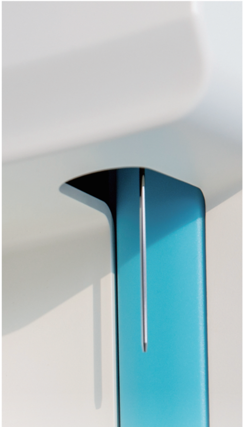

## Parameters

WBC. LYM#. MID#. GKAN#. LYM%, MID% GRAN%, RBC, HGB, HCT, MCV, MCH, MCHC, RDW-CV, RDW-SD, PLT, MPV, PDW, PCT, P-LCR, P-LCC 3-part differentiation of WBC, 21 parameters and 3 histograms

## Principles of operation

WBC/KBC/PLI: electrical impedance hab. onotoelectric colorimeir

## Aspiration volume

Whole blood 10 uL, pre-diluted 20 uL

## Aperture diameter

WBC/RBC/PLT 80 um

## Throughput

30 samples per nour

## Data storage

Up to 100,000 samples results with histograms

## Alarms

error messages

## Dilution ratio

whole blood

Capillarv blood

WBC/HGB

1:250

1.250

RBC/PLT

1:40000

1:40000

## Display

10.4-inch color LCD, resolution 800*600

## Control and calibration

L-J, X, X-R, X-B four control modes, manual and auto-calibration

## Input/Output

Support Rs23z, standard network port and Usb shortcut keys with standard mouse and keyboard Internal 57mm thermal printer, parallel port and USB for external printer

## Power

AC 100-240V, 50/60Hz, 180VA

## Dimension &amp; weight

485mm(L) × 331mm(W) × 460mm(H), about 20 kg

## URIT Medical Electronic Co., Ltd.

## Head Office

## URIT-2900Plus

3-Part-Diff Hematology Analyzer

21 parameters and 3 histograms

Hourly throughput up to 30 samples

Large 10.4-inch display

5 shortcut operation keys

- 21 parameters witn P\_LUu, F\_LUR and wBu, RBU, PLI nistograms
- Throughput up to 30 samples per hour
- Impedance method for WBC, RBC and PLT
- Photoele ic colorimetry method for HGB with cyanide free reagent
- Micro samo olume at 10uL tor whole blood mode and 20uL tor pre-diluted mode
- On board storage capacity of 100,000 sample results
- Optional reagent close system with external bar code scanning or key in
- Four kinds of QC modes: L-J, X, X-R and X-B
- Support USB data backup &amp; system upgrade
- Built-in thermal printer
- LIS and HIS available with HL7 protocol

## Accurate and Precise Results

- Proven impedance measurement tecnnoloav
- Auto internal &amp; external cleanina tor aspiration probel
- High precision syringes
- 80 um ruby aperture

## Easy to Use

- = Large color Lub wiln man resolution
- o snoricul operation keys
- Workina status indicator liaht
- Mouse and keyboard connection for patient data input
- Identifiable color reagent connection design

## Cost-effective

- lidv tluid svstem with low reagent consumption
- Flexible reagent packaging from original manufacturer
- 30+ reagent joint venture manufacturers worldwide

## Low and Easy Maintenance

- Special self-checking function during initialization
- Auto clog removing by apenure cauterzing and musning
- carror messages
- Openable tront panel and side door

## Nearly Perfect Software Function

- rriendiv interace and illustrated icons
- On board storage up to 100,000 sample results
- Support LIS and HIS connection
- L-J, X, X-R and X-B QC methods
- allor-made mutli-lanquade operation svstem

## Reliable Spare Parts Quality

- vvell-known global spare parts suppilers
- Hian pentormance PCB board trom tullv automatic assemblv line
- Individual quality control management for each single component

## International Standard Certificate and Registration Documents

- IS09001 &amp; ISO13485
- ue. rsu. clinical test report, risk analvsis report|
- Others

## Professional Technical Support

- 24 × ‹ arouna-ine-clock response
- entire lite cvcle service solution
- Door-to-door service for complicated problems
- Provide qualification certificate to skilled engineer

