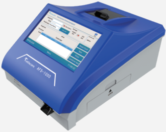
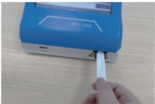
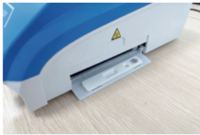

Sabore '

AFS-1000

S-1000

Read the test items

Insert the reagent card

## AFS-1000

## Fluorescent Immunoanalyzer

Small and light, fast and stable

--

Small and convenient for indoor and outdoor use

--

Vertical optical path design, higher efficiency and accuracy

Abandon the card after the test

Print test results

Easy to operate, insert the ID card for instant testing

Automatic card inputting, card abandoning and automatic identification of testing items, easy and automated

Read the test items

Insert the reagent card

## Performance parameters

- T esting principle: Fluorescence immunoassay
- T esting channel: Single
- T esting speed: Time for one T est &lt; 10 s
- Sample type: 9 sample types to customized (e.g.: Serum, plasma, whole blood, urine, etc.)
- T esting items: Not more than 255 items
- Number of items per card: Multiple items per card are supported
- Screen size: 7 inch HD LCD
- Operating system: Linux

Abandon the card after the test

Print test results

- Data storage volume: &gt; 10000 records
- Data transmission:Data transmission: 4G, USB2.0, RS232C, wifi (The ultimate selection of the user shall prevail), Ethernet, support LIS, HIS
- Language interface: Chinese, English (customized)
- Printer: Built-in thermal printer
- Reagent card code: Bar code, QR code  (customizable)
- Applicable card type: ID card
- Dimension: 215 mm * 302 mm * 155 mm
- Net weight: 3 kg

items, easy and automated

AFS-1000

