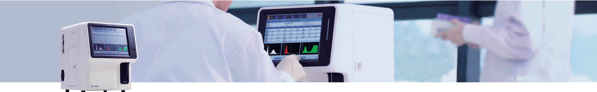

EVER URIT Medical Electronic Co., Ltd.

Head Office

Add.: No. D-07 Information Industry

District. High-tech Zone Guilin. Guanayi 541004 PR China

Tel+86-773-2288586

Fax: +86-773-2288560

E-mail: export@uritest com service @uritest com http://www.urit.com

Add.: Room EJ, 24th Floor, New Baohui Building, Nanhai Road,

Nanchan District Shenzhen PR China

Tel- +86-755-36413721

URIT

Since 1984

Global Diagnostics Supplier

160180

100

Never Compromise Thirst for Speed, Faster than Ever

BH-40P

3-Part-Diff Hematology Analyzer

Never Compromise Thirst for Speed, Faster than Ever

42 samples/hour of single chamber

Compact and minimized size

2 reagents system (Diluent &amp; Lyse)

RFID reagent close system optional

Guilin, China

Function ort

• Micro sample volume at 13uL for whole blood mode and 20uL for pre-dilute mode

• On board storage capacity of 100,000 samples results

Support

CERTIFICATE

teloo Amlymer: (k11-5500 UK-3000PM

Erine Analyzer: ER11-0600, ER11-50)

Ocalstry Malyzer: (R17-414

Jetrolridalyzr: (811-90071

leer

