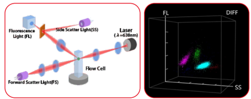
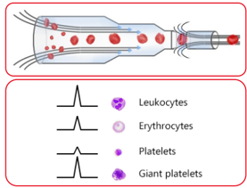

URIT Medical Electronic Co., Ltd.

Head Office

Add.: No. D-07 Information Industry District,

High-tech Zone, Guilin, Guangxi, 541004, P.R. China

Tel: +86-773-2288586

Fax: +86-773-2288560

E-mail: export@uritest.com service@uritest.com http://www.urit.com

Shenzhen Office

Add.: Room EJ, 24th Floor, New Baohui Building, Nanhai Road,

Nanshan District, Shenzhen, P.R. China

Tel: +86-755-26413721

neCoco c-cocololl

URIT since 1984

Global Diagnostics Supplier

BH-6180

BH-6180

6-Part-Diff Hematology Analyzer

Fluorescence Flow Cytometry Technology

One-stop Capillary Blood Testing

44 Reportable Parameters including Body-fluid Analysis

Dual-channel PLT(PLT-I &amp; PLT-O)

Dedicated Channel for HPC (Hematopoietic Progenitor Cell) Alarm

Guilin, China

000000

6

44 Reportable Parameters including Body-fluid Analysis

Dual-channel PLT(PLT-I &amp; PLT-O)

Dedicated Channel for HPC(Hematopoietic Progenitor Cell) Alarm ng

## BH-6180 · IMG (#,%) provide valuable he

or leukemic reaction diagnosi

DIFF

## Superior Nucleic Acid Fluorescence Staining Technology · 360° rotating code scanning · RET(#,%), IRF,RHE informati monitoring of anemia

