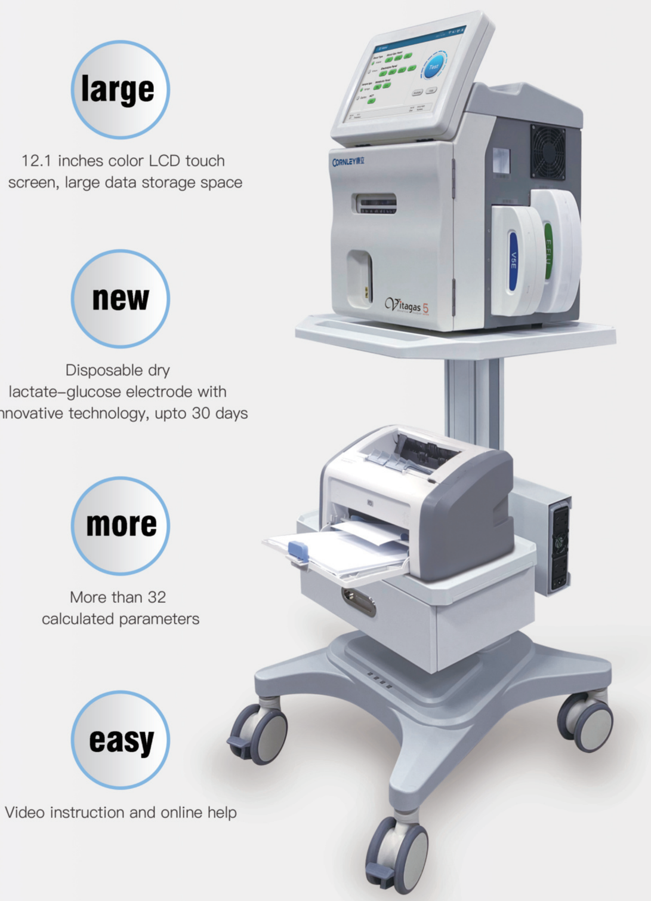

## Applicable department

- Laboratory, ICU, Respiratory, Emergency, Anesthesiology, Operating Room, Pediatrics, Obstetrics, Neonatology, Cardiology department, Cardiac surgery department, Neurology department, Neurosurgery, Nephrology, Geriatrics, fever clinic, etc

## Applicable Conditions

## Clinical diagnosis

- Objective assessment criteria for oxygenation, ventilation and acid-base balance
- Severity classification of asthma in acute attack
- Severity classification of COPD during acute exacerbation
- Diagnostic criteria for neonatal asphyxia
- Diagnosis and classification of respiratory failure and hypoxemia

## Intensive care

- Condition and prognosis of severe trauma, organ failure, etc.
- Indications for ICU transfer in/out
- Routine monitoring of critical patients before and after rescue
- APS score for critical patients

## Treatment monitoring

- Indications before and after using the ventilator and the basis for adjusting the ventilator
- Analysis and treatment monitoring of acid-base disorder
- hemodialysis efficacy, treatment efficacy of renal failure patients
- Perioperative management and anesthesia safety monitoring
- Dynamic observation of asthma and ARDS, before and after oxygen therapy

## SHENZHEN CORNLEY BIO-MEDICAL CO., LTD.

Add: 6/F Building 10, Block 3, Yangbei Industrial Park Huangtian, Huangtian Community, Hangcheng Street, Bao'an, Shenzhen, Guangdong, China 518128.

Tel: +86 755 86330808

E-mail: sales@cornley.com

Fax: +86 755 86330882

CORNLEY

Blood TIPe

0 Aren

• Hemous c Panel

LoC

Test

Vitagas 5

## Sample type

Whole Blood, Arterial Blood, Venous Blood, Serum, Plasma, CSF

## Models

Vitagas 5 : pH. pO,. pCO,. Hct, Kt. Nat, Cl. Cat

Vitagas 5A: pH. pO,: pCO,. Hot

Vitagas 5B: pH. pO,. pCO,. Hct, Glu. Lac

Vitagas 5E: pH. pO,. pCO,. Hct, Kt. Nat, CI. Cat, Glu, Lac

## Calculation Parameters

pH(TC). pCO\_(TC). pO\_(TC). TCO2, HCO3. BE. BEecf. SBC, s02%, nCa2+(7.4). TCa+, AG. RI. pO\_(A-a). Pso. THb, BBP, BBb. pO,/FiOz. pO\_(TC)/FiO\_. cH+(TC). mOsm. pO\_(A). pO\_(A, TC). pO\_(A-a,T). pO\_(a/A,T). pO\_(a/A), RI(T), AG(k+), cOcCO(p), ctCOB)

## Arteriovenous combination calculation parameters

ScvOz. pCO\_(gap), CaOz, CvO, CaCO\_, CvCOz, SaOz, SvO,, VO,, VCO2

## Features

- Multi-specification reagent packs (50 tests/pack-1200 tests/pack): stored at room temperature for 9 months, valid for up to 45 days on-board.
- Integrated flush solution pack to avoid biological pollution and without waste till used up.
- Automatic sample aspiration and sample needle cleaning, support capillary, arterial blood syringe, test tube, etc.
- Sample analysis speed ~60s (with Lac/Glu &lt;90s), blood volume for the whole parameters &lt;170ul.
- Built-in multi-level quality control rules, quality control charts, quality control data, printable and exportable.
- Support bi-direction LIS, built-in WiFi, 4G, and remote maintenance system.
- Built-in 2D barcode scanner and thermal printer, support external USB printer.
- Built-in UPS, optional trolley and external large-capacity UPS.

