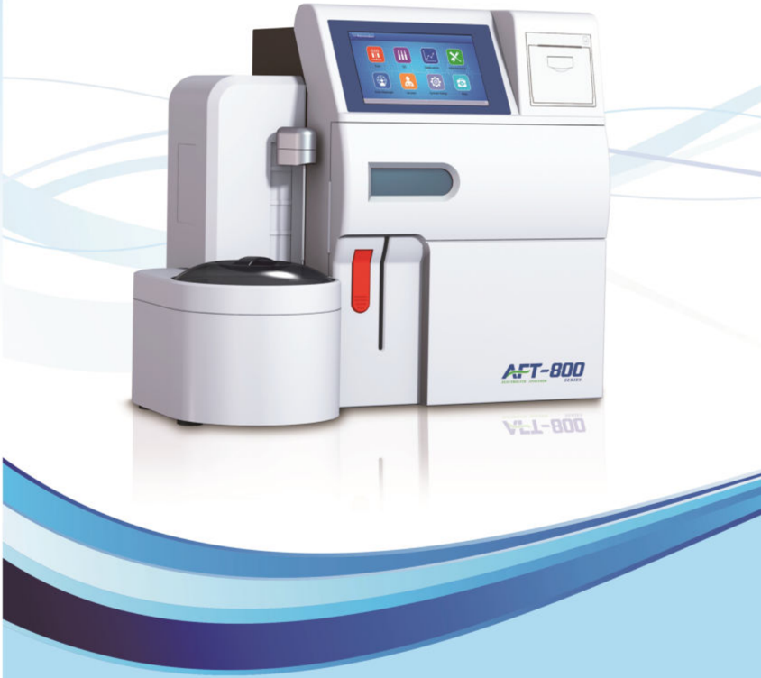

## Sample Type: Serum, Whole Blood, Plasma, Urine, CSF

| Test Range and Accuracy   | Test Range and Accuracy   | Test Range and Accuracy   |
|---------------------------|---------------------------|---------------------------|
| Item                      | Range (mmol/L)            | SD (mmol/L)               |
| K*                        | 0.5~15.0 mmol/L           | ≤1.0%                     |
| Nat                       | 20.0~200.0 mmol/L         | ≤1.0%                     |
| CH                        | 20.0~200.0 mmol/L         | ≤1.0%                     |
| Ca?+                      | 0.1~5.0 mmol/L            | 61.5%                     |
| pH                        | 6.0~9.0                   | ≤1.0%                     |
| Li*                       | 0.0~3.0 mmol/L            | ≤1.5%                     |
| TCO,                      | 6.0~50.0 mmol/L           | ≤3.0%                     |

| Working Environment                | Working Environment                                                              |
|------------------------------------|----------------------------------------------------------------------------------|
| Ambient Temperature: 10°C~40°C     | Relative Humidity: ≤80%                                                          |
| Atmospheric Pressure: 86kPa~106kPa | Power Supply: 100V-240V~ 50Hz/60Hz                                               |
| Power: 300VA                       | Properly grounded, away from electromagnetic interference, avoid direct sunlight |
| Dimension: 340x283x455mm           | Net Weight: about 12kg                                                           |

| Reagent Kit            | Reagent Kit    | Reagent Kit                                                            | Reagent Kit   |
|------------------------|----------------|------------------------------------------------------------------------|---------------|
| Item                   | Model          | Packing Specification                                                  | Type          |
| ISE Reagent Pack       | AFT-A8 I&#124; | One pack including Cal A 1000ml, Cal B 250ml and TCO, calibration 50ml | Liquid        |
| ISE Reagent Pack       | AFT-A8 III     | One pack including Cal A 1000ml and Cal B 250ml                        | Liquid        |
| TCO, Reaction Solution | AFT-A7 &#124;  | One bottle of 100ml                                                    | Liquid        |

## AFT-800 Series

Electrolyte Analyzer

## Model:

AFT-800A: K*. Na'. Cl. TCO,

AFT-800B: K*. Na*. Cl. Ca. pH. TCO,

AFT-80OD: K*. Na*. CF. Ca, Lit. pH. TCO,

AFT-800E: K+. Na'. Cl

AFT-800F: K+. Nat. Cl. Lit

AFT-800G: K*. Nat. Cl. Ca. pH.

AFT-800H: K*. Na'. Cl. Ca. Lit. pH.

## Barcode Scanner

