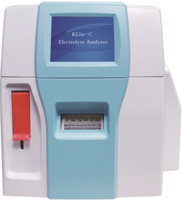
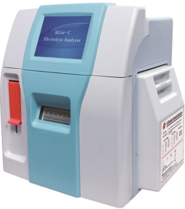

## CORNLEY FI

## KLite-C Electrolyte Analyzer

K+/Na*/Cl

K*/Na*/CI/Ca+/pH

- Intuitive graphical user interface, touch screen and graphically guided instructions
- Fast and error-free data entry using barcode scanner
- Sample size: 65ul, and fast test results: 30 seconds
- Big volume reagent pack is optional
- Low analyzer purchase price and low cost per test

## Sample Type

Plasma, Serum, Whole Blood, Urine

## Models

K+/Na+/CI

K+/Na*/Cl/Cat/pH

## Test Range and Accuracy

| Channel   | Range             |   Resolution | CV%   |
|-----------|-------------------|--------------|-------|
| pH        | 6.00~9.00         |         0.01 | < 1.0 |
| K*        | 0.50~10.00mmol/L  |         0.01 | < 1.0 |
| Nat       | 20.0~200.0 mmol/L |         0.1  | < 1.0 |
|           | 20.0~200.0 mmol/L |         0.1  | < 1.0 |
| Ca?+      | 0.3~5.0 mmol/L    |         0.01 | < 1.5 |

## Working Environment

| Relative Humidity   | ≤85%                  |
|---------------------|-----------------------|
| Ambient Temperature | 5°C~40°C              |
| Sun Radiation       | Avoid direct sunshine |
| Power Supply        | 100-240V ~ 50/60Hz    |

## Main Characteristics

- Automatic or on-demand calibration
- Sleep mode to save reagent
- High efficiency cleaning procedure
- On-line operation and self-diagnostic tutorials
- Above 1000 results storage

## Meizhou Cornley Hi-Tech Co., Ltd.

Add: 6/F Building 10, Yangbei Industrial Park, Shenzhen, China.

Email: sales@cornley.com

Tel: +86-0755-86330808

K+/Na*/CI/Ca+/pH//Ref

