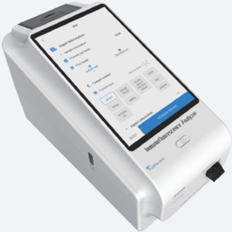
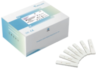

## Make Medical Tests More Accurate

## Immunofluorescence Analyzer L300

Add: Room 425-433, 621-630, Building H6, No. 39 Ruihe Road, Huangpu District, 510700 Guangzhou City, Guangdong Province, PEOPLE'S REPUBLIC OF CHINA

Tel: +86-20-28200186

Fax: +86-20-28200183

Email: info@labsim-ivd.com

Web: www.labsim-ivd.com

Clinical Tactina.

BESET

Sariscare

Madical Contor

Immunoflusrestence Analyzer

L300

## Immunofluorescence Analyzer

Smooth operation, portable detection

--

New UI interaction technology, smoother operation, accurate detection, automatic

--

Identification of detection items, automatic collection of discarded cards

## Application

Emergency Laboratory, Clinical Department and other Medical Center, Examination Center, Research Laboratory and so on

Clinical Testing

Medical Center

## Performance parameters

- T esting principle: Fluorescence immunoassay
- T esting channel: Single
- T esting speed: Time for one test &lt; 10 s
- Sample type: 9 sample types to customized (e.g.: Serum, plasma, whole blood, urine, etc.)
- T esting items: No more than 255 items
- Number of items per card: Multiple items per card are supported
- Screen size: 8.1 inch touch screen
- Operating system: Android

TO BICAN TESING

T

T

- One-step operation to complete the testing
- Automatically identify test items, throw away card, print result, and upload to LIS
- Data storage volume: &gt;10000 records
- Data transmission: USB, support LIS
- Language interface: Chinese, English (customized)
- Printer: Built-in thermal printer, Can be connected to a specified model printer
- Reagent card code: Bar code, QR code  (customized)
- Applicable card type:  ID card
- Dimension: 325 mm * 159 mm * 202 mm
- Net weight: 3 kg

Add test items through ID card. Then insert reagent card and result will be printed after testing.

268R#*

202206020015

## Immunofluorescence Reagent

| Category        | Test Item   | Item No.    | Sample         | Reaction Time   | Linearity Range                       | Reference                                                                                                                                                                                                                                              |
|-----------------|-------------|-------------|----------------|-----------------|---------------------------------------|--------------------------------------------------------------------------------------------------------------------------------------------------------------------------------------------------------------------------------------------------------|
| Infection       | CRP         | SA.02.00002 | Serum / Plasma | 3 min           | 0.5-200 mg/L                          | < 10 mg/L                                                                                                                                                                                                                                              |
| Infection       | PCT         | SA.02.00004 | Serum / Plasma | 15 min          | 0.1-100 ng/mL                         | < 0.5 ng/mL                                                                                                                                                                                                                                            |
| Infection       | SAA         | SA.02.00005 | Serum / Plasma | 15 min          | 2.0-100 mg/mL                         | < 10 mg/mL                                                                                                                                                                                                                                             |
| Infection       | IL-6        | SA.02.00006 | Serum / Plasma | 15 min          | 3.0-4000 pg/mL                        | < 7.5 pg/mL                                                                                                                                                                                                                                            |
| Infection       | CRP / SAA   | SA.02.00007 | Serum / Plasma | 15 min          | CRP: 0.5-150 mg/L SAA: 0.5-300 mg/L   | CRP < 8.28 mg/L SAA < 10 mg/L                                                                                                                                                                                                                          |
| Infection       | PCT / IL-6  | SA.02.00008 | Serum / Plasma | 15 min          | IL-6: 10-1000 pg/mL PCT: 0.1-40 ng/mL | IL-6 < 15 pg/mL PCT < 0.5 ng/mL                                                                                                                                                                                                                        |
| Infection       | HBP / PCT   | SA.02.00053 | plasma         | 15 min          | HBP: 1-200 ng/mL PCT: 0.05-50 ng/mL   | HBP＜15 ng/mL PCT＜0.5 ng/mL                                                                                                                                                                                                                             |
| Infection       | HBP         | SA.02.00054 | Plasma         | 15 min          | 5-300 ng/mL                           | ＜15 ng/mL                                                                                                                                                                                                                                              |
| Sex Hormone     | PROG        | SA.02.00009 | Serum / Plasma | 15 min          | 1.2-120 nmol/L                        | Follicular phase: 0.6-1.9 nmol/L Oviposit period: 0.95-6.68 nmol/L Luteal phase: 6.8-72 nmol/L The first trimester of pregnancy: 12.4-190.8 nmol/L The first trimester of pregnancy: 48.97-190.8 nmol/L Menopause: 0-3.2 nmol/L Male: 0.31-2.67 nmol/L |
| Sex Hormone     | FSH         | SA.02.00010 | Serum / Plasma | 15 min          | 2-100 IU/L                            | Follicular phase: 1.5-7.5 IU/L Oviposit period: 2.8-12.5 IU/L Luteal phase: 1.8-5.0 IU/L After menopause: 15.0-76.0 1U/L Male: 1.25-19.62 IU/L                                                                                                         |
| Sex Hormone     | LH          | SA.02.00011 | Serum / Plasma | 15 min          | 2-100 IU/L                            | Follicular phase: 2-12.5 IU/L Oviposit period: 13-106 IU/L Luteal phase: 0-10.5 IU/L After menopause: 7-65.2 1U/L Male: 1.15-8.65 IU/L                                                                                                                 |
| Sex Hormone     | β-HCG       | SA.02.00012 | Serum / Plasma | 15 min          | 4-10000 mIU/mL                        | ＜10m IU/mL                                                                                                                                                                                                                                             |
| Sex Hormone     | PRL         | SA.02.00013 | Serum / Plasma | 15 min          | 40-3000 μIU/mL                        | Premenopausal women: 74-566 μIU/mL Postmenopausal women: 68-528 μIU/mL Male: 63.5-350 μIU/mL                                                                                                                                                           |
| Sex Hormone     | Cor         | SA.02.00014 | Serum / Plasma | 15 min          | 0.5 μg/dL-36 μg/dL                    | 3.56-22.73 μg/dL                                                                                                                                                                                                                                       |
| Sex Hormone     | AMH         | SA.02.00015 | Serum / Plasma | 15 min          | 0.1-24 ng/mL                          | 2-14 ng/mL                                                                                                                                                                                                                                             |
| Thyroid Hormone | TSH         | SA.02.00016 | Serum / Plasma | 15 min          | 0.1-100 μIU/mL                        | 0.3-5.6 μIU/mL                                                                                                                                                                                                                                         |
| Thyroid Hormone | T3          | SA.02.00017 | Serum / Plasma | 15+10 min       | 0.77-6.0 nmol/L                       | 1.34-2.73 nmol/L                                                                                                                                                                                                                                       |
| Thyroid Hormone | T4          | SA.02.00018 | Serum / Plasma | 15 min          | 15-300 nmol/L                         | 78.51-157.01 nmol/L                                                                                                                                                                                                                                    |
| Thyroid Hormone | FT3         | SA.02.00057 | Serum / Plasma | 10 min          | 1.6-46 pmol/L                         | 3.1-6.8 pmol/L                                                                                                                                                                                                                                         |
| Thyroid Hormone | FT4         | SA.02.00058 | Serum / Plasma | 10 min          | 3.2-77.2 pmol/L                       | 11.5-22.7 pmol/L                                                                                                                                                                                                                                       |
| Cardiac Marker  | CK-MB       | SA.02.00001 | Serum / Plasma | 15 min          | CK-MB: 1-100 ng/mL                    | CK-MB < 5 ng/mL                                                                                                                                                                                                                                        |
| Cardiac Marker  | cTnl        | SA.02.00019 | Serum / Plasma | 15 min          | 0.1-40 ng/mL                          | < 0.5 ng/mL                                                                                                                                                                                                                                            |
| Cardiac Marker  | Myo         | SA.02.00020 | Serum / Plasma | 15 min          | 5-400 ng/mL                           | ≤ 60 ng/mL                                                                                                                                                                                                                                             |
| Cardiac Marker  | NT-proBNP   | SA.02.00021 | Serum / Plasma | 15 min          | 50-20000 pg/mL                        | ≤ 300 pg/mL（< 75 years old） ≤ 450 pg/mL（≥ 75 years old）                                                                                                                                                                                                |
| Cardiac Marker  | H-FABP      | SA.02.00022 | Serum / Plasma | 15 min          | 3-100 ng/mL                           | ≤ 7 ng/mL                                                                                                                                                                                                                                              |

## TEST KIT

| Cardiac Marker   | D-Dimer                     | SA.02.00023   | Serum / Plasma               | 15 min   | 0.1-10 mg/L                                            | < 0.5 mg/L                                                                                                                                                                 |
|------------------|-----------------------------|---------------|------------------------------|----------|--------------------------------------------------------|----------------------------------------------------------------------------------------------------------------------------------------------------------------------------|
| Cardiac Marker   | cTnl / Myo / CK-MB (3 In 1) | SA.02.00024   | Serum / Plasma               | 15 min   | cTnI: 0.1-40 ng/mL CK-MB: 1-100 ng/mL Myo: 5-400 ng/mL | cTnI < 0.3 ng/mL CK-MB < 5 ng/mL Myo < 60 ng/mL cTnI＜0.5ng/mL                                                                                                              |
| Cardiac Marker   | cTnI / NT-proBNP            | SA.02.00025   | Serum / Plasma               | 15 min   | cTnI: 0.1-40ng/mL NT-proBNP: 50-20000 pg/mL            | NT-proBNP≤300pg/mL（ ＜75 years old） NT-proBNP≤450pg/mL（≥ 75 years old）                                                                                                      |
| Cardiac Marker   | cTnT                        | SA.02.00052   | Serum / Plasma / Whole blood | 15 min   | 30.0-10000.0pg/mL                                      | ＜100pg/mL                                                                                                                                                                  |
| Kidney           | NGAL                        | SA.02.00026   | Serum / Plasma               | 10 min   | 50-1000 ng/mL                                          | < 60 ng/mL                                                                                                                                                                 |
| Kidney           | mAlb                        | SA.02.00027   | Urine                        | 15 min   | 5-300 mg/L                                             | 0-20 mg/L                                                                                                                                                                  |
| Kidney           | CysC                        | SA.02.00028   | Serum / Plasma               | 5 min    | 0.2-10 mg/L                                            | 0.5-1.1 mg/L                                                                                                                                                               |
| Kidney           | β2-MG                       | SA.02.00029   | Serum / Plasma               | 15 min   | 0.3-20 mg/L                                            | 1.0-2.7 mg/L                                                                                                                                                               |
| Diabetes         | HbA1c                       | SA.02.00030   | Whole Blood                  | 15 min   | 2-14%                                                  | 3.8～5.8%                                                                                                                                                                   |
| Cancer           | CEA                         | SA.02.00034   | Serum / Plasma               | 15 min   | 2.5-1000 ng/mL                                         | < 35 ng/mL                                                                                                                                                                 |
| Cancer           | AFP                         | SA.02.00035   | Serum / Plasma               | 15 min   | 5-1000 ng/mL                                           | < 25 ng/mL                                                                                                                                                                 |
| Cancer           | PSA                         | SA.02.00036   | Serum / Plasma               | 15 min   | 2.0-100.0 ng/mL                                        | < 4ng/mL                                                                                                                                                                   |
| Cancer           | TK1                         | SA.02.00055   | Serum / Plasma               | 15 min   | 1-20 pmol/L                                            | ＜2pmol/L                                                                                                                                                                   |
| Infectious       | SARS-Cov-2                  | SA.02.00037   | Naso / Oropharyn- geal swab  | 15 min   | /                                                      | /                                                                                                                                                                          |
| Infectious       | Dengue IgG / IgM            | SA.02.00038   | Serum / Plasma / Whole blood | 15 min   | /                                                      | /                                                                                                                                                                          |
| Infectious       | SARS-Cov-2 / FluA+B         | SA.02.00039   | Naso / Oropharyn- geal swab  | 15 min   | /                                                      | /                                                                                                                                                                          |
| Infectious       | SARS-CoV-2 IgG / IgM        | SA.02.00040   | Serum / Plasma               | 15 min   | /                                                      | /                                                                                                                                                                          |
| Infectious       | HP-Ab                       | SA.02.00041   | Serum / Plasma               | 15 min   | /                                                      | /                                                                                                                                                                          |
| Infectious       | HP-Ag                       | SA.02.00042   | Feces                        | 15 min   | /                                                      | /                                                                                                                                                                          |
| Infectious       | FOB                         | SA.02.00043   | Feces                        | 15 min   | /                                                      | /                                                                                                                                                                          |
| Disease          | p.f/pan                     | SA.02.00044   | Whole blood                  | 15 min   | /                                                      | /                                                                                                                                                                          |
| Infectious       | RSV                         | SA.02.00045   | Naso / Oropharyn- geal swab  | 15 min   | /                                                      | /                                                                                                                                                                          |
| Infectious       | Influenza A/B               | SA.02.00046   | Naso / Oropharyn- geal swab  | 15 min   | /                                                      | /                                                                                                                                                                          |
| Infectious       | Strep A                     | SA.02.00047   | Naso / Oropharyn- geal swab  | 15 min   | /                                                      | /                                                                                                                                                                          |
| Infectious       | Adenovirus                  | SA.02.00048   | Naso / Oropharyn- geal swab  | 15 min   | /                                                      | /                                                                                                                                                                          |
| Infectious       | Mycoplasma IgM              | SA.02.00049   | Serum / Plasma / Whole blood | 15 min   | /                                                      | /                                                                                                                                                                          |
| Infectious       | Influenza A/B+H1N1          | SA.02.00050   | Naso / Oropharyn- geal swab  | 15 min   | /                                                      | /                                                                                                                                                                          |
| Infectious       | Dengue NS1 Ag               | SA.02.00051   | Serum / Plasma / Whole blood | 15 min   | /                                                      | /                                                                                                                                                                          |
| Gastric Function | PG Ⅰ/Ⅱ                      | SA.02.00033   | Serum / Plasma               | 15 min   | PGⅠ : 70-200 ng/mL PGⅡ : < 20 ng/mL                    | PGⅠ : 5-200 ng/mL PGⅡ : 2.5-100 ng/mL                                                                                                                                      |
| Gastric Function | G17                         | SA.02.00056   | Serum / Plasma               | 15 min   | 1-50 pmol/L                                            | 1-7 pmol/L                                                                                                                                                                 |
| Others           | 25-OH-VD                    | SA.02.00031   | Serum / Plasma               | 10 min   | 8-80 ng/mL                                             | 30-80 ng/mL                                                                                                                                                                |
| Others           | IgE                         | SA.02.00032   | Serum / Plasma               | 15 min   | 8-1000 IU/mL                                           | Neonatal IgE was 0-1.5 iu/mL. IgE within 1 year: 0-15 IU/mL; 1-5 years IgE: 0-60 IU/mL; IgE for ages 6-9: 0-90 IU/mL; 10-15 years IgE: 0-200 IU/mL; Adult IgE: 0-100 IU/mL |
| Others           | VB12                        | SA.02.00059   | Serum / Plasma               | 15 min   | 150-1500 pg/mL                                         | 240-800 pg/mL                                                                                                                                                              |