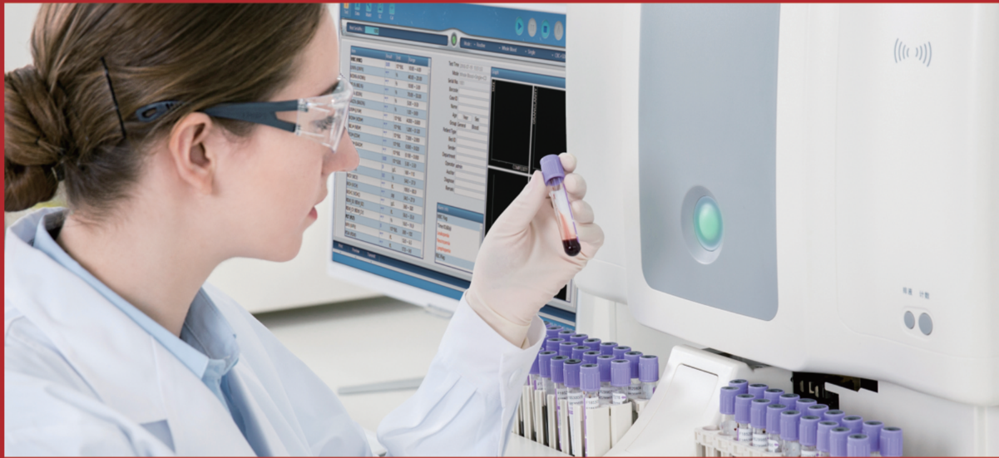

## 34 parameters

WBC, LYM%, MON%, NEU%, E05%, BAS%, LYM#, MON#, NEU#, EOS#, BAS#, RBC, HGB, HCT, MCV. MCH. MCHG. ROW CV. KOW SD. PLI.MPV. POW. PCI.P LCK.P LCG. KEIC%

RETIC\_ABS, IRF

6 research parameters: ALY#, ALY%, LIC#, LIC%, NRBC#, NRBC%

2 histograms for RBC and PLT

2 scatter grams: 5-part differential scatter gram eosinophils and Neutrophils scatter gram

IWo 3-D stereoarams

## Principles of operation

WBC 5-part: flow cytometry(FCM) + 4 angles laser light scatter

WBC analysis: optical and impedance measurements kbu/rLl analvsis, impedance metnod

HGB test: cyanide-free reagent colorimetry

RETIC test: flow cytometry (FCM) + laser light scatter + chemical dye method

## Reagent

Diluent, detergent, lyse, sheath, RE lu Staining solution

## Sampling modes

Auto loader 20 uL, manual mode 20 uL, pre-diluted mode 20 uL

## Aperture diameter

WBC 100 um, RBC/PLT 68 um

## Throughput

Auto &amp; manual mode: up to 60 samples per hour, support STAT

## Sampling device

Auto loader with 50 (10 x 5 racks) sample storage capacity bulll-in bar code reader

## Data storage

Up to 200,000 sample results with all grams

## Alarms

Error messages

## Display

Pu aisplay with windows system, 1r-inch color trl aisplay

LIS

Support, with HL7 protocol

## Power

AC 100-240V, 50/60Hz, 300VA

## Dimension &amp; Weight

580 mm (L) x 750 mm (W) x 550 mm (H), about 73 kg

## URIT Medical Electronic Co., Ltd.

## URIT-5380

5-Part-Diff Hematology Analyzer

34 Parameters including RETIC\_ABS, RETIC%, IRF

Flow Cytometry (FCM) + Multi Angle Scatter Separation (MASS)

Hourly throughput up to 60 samples

Resistant RBC mode

Multi-language software available (Tailor-Made)

- Reticulocyte test: RETIC\_ABS, RETIC%, IRF
- 34 parameters, 2 histograms, 2 scatter grams and two 3D stereograms
- Hourly throughput up to 60 samples
- Auto loader with 50 sample storage capacity
- The combination of WIC and WOC for WBC counting
- Impedance method for RBC and PLT counting
- Cyanide free reagent for hemoglobin counting
- On board storage capacity of 200,000 samples with all grams
- Built-in bar code reader
- LIS and HIS available with HL7 protocol

## Laser Scatter

- Multi angle scatter separation (MASS)
- Original cell morphology signal
- Stable and long-lasting

## Sheath Flow Regulation

- Chemical dye free technology
- Onlv sneath reagent tor WBG 5-Ditt|

## Sample Aspiration Device

- Flexible sample aspiration blood collection tubes including. standara tube, capillary tube, asposable plastic tube ana micro tube

## Electronic and Mechanical Components

- Individual quality control management
- Militarv level
- 20 vears tiled-proven

## 2D+3D Grams

- Two 2D histograms: RBC and PLT
- Two 2D scattergrams: 5-part differential
- Eosinophil and Neutrophil
- Iwo 3D multi angle vision grams

## Data Management

- On board storage capacity of 200,000 samples with all grams
- Protessional data statistics querv svstem

## Operation Interface

- Simple operate with user friendly illustrated icons
- Hanav tool tips
- Unique URIT operation interface like all URIT hematology series

## Quality Control Solution

- URIT original QC reagent with multi method as L-J, X, X-R, X-B, etc.
- Third party QC solution available