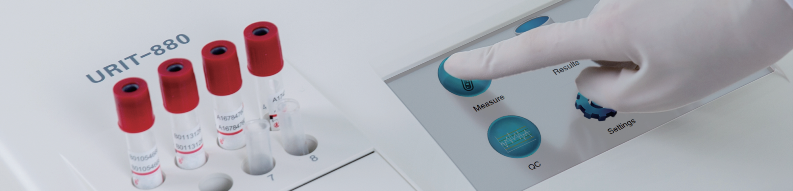

## URIT Medical Electronic Co., Ltd.

## Head Office

Add.. No. D-ur Intormation Industry District, High-tech Zone, Guilin, Guangxi, 541004, P.R. China lel: +86-173-2288586 rax: +86-173-2288564 E-mail: export@uritest.com service@uritest.com nttp.//www.urit.com

## Shenzhen Office

Add.: Room Ev, 24th Floor, New Baohul Building, Nanhal Road Nanshan District, Shenzhen, P.R. China Tel: +86-155-26413121 Rey: 201905-1(20190520.

URI| since 1984 Global Diagnostics Supplier

## URIT-880 Semi-automatic Chemistry Analyzer

Large color touch screen High quality filters with 8 wavelengths 8 inner incubation positions Easy maintenance design

## Powerful and User-friendly Design

- Large 7-inch color touch screen
- intunive user intenace win easy-to-toucn icon
- Large memory capacity 30, 000 results storage
- Internal thermal printer

## Guarantee High Quality Results

- High quality filters with 8 wavelengths, realizing real dual wavelengths detection
- Accurate sampling volume: 100~9999 uL adjustable
- Quartz flowcell with high light transmission
- Available to calibrate each wavelength

## Inner Incubation Positions

- 8 incubation positions with 25°C, 30°C, 37°C and room temperature optional
- Save the need of extra thermostat water bath

## g Minimal Intervention Demands

- Auto prompt clean after each test
- External peristaltic tube easy to change

## Multifunctional Interfaces

- External printer by LPT
- Keyboard by PS/2 or USB
- Data backup and recovery from USB
- Upgrade by SD/ RJ-45

| Analysis method          | Endpoint, kinetic, 2-point kinetic, and polygon method   |
|--------------------------|----------------------------------------------------------|
| Light source             | Halogen lamp, 6V/10W                                     |
| Wavelength               | 340nm, 405nm, 492nm, 510nm, 546nm, 578nm, 630nm, 700nm   |
| Absorbance range         | -0.3Abs~4.0Abs                                           |
| Accuracy bias            | ≤ 2nm                                                    |
| Half broadband           | ≤10nm                                                    |
| Flowcell                 | Quartz cell, 10mm optical diameter, 32 uL volume         |
| Temperature control      | 25°C, 30°C, 37°C and room temperature optional           |
| Sampling volume          | 100 ML-9999 uL, recommended: ≥ 500 uL                    |
| Carry over rate          | ≤ 1.0%                                                   |
| Drift rate of absorbance | ≤0.005Abs/20min                                          |
| Memory                   | Up to 300 items and 30, 000 test results                 |
| Display                  | 7-inch color touch screen, 800 × 480 resolution          |
| Printer                  | Built-in thermal printer                                 |
| Interface                | 1 SD, 3 USB, 1 PS/2, 1 LPT and 1 RJ-45                   |
| Ambient                  | Room temperature: 10 °C~35°C; humidity: 40%~85%          |
| Power                    | 110V/220V, 50Hz/60Hz                                     |
| Dimension                | 360mm(L) × 320mm(W) × 145mm(H)                           |
| Weight                   | About 5.9 kg                                             |